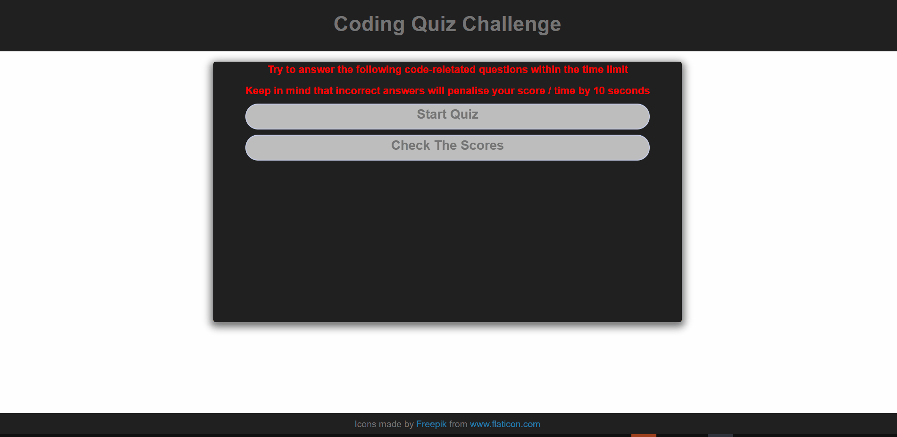

# Code Quiz

## JavaScrit Code Quiz
At some point in your journey to become a full-stack web developer, you’ll likely be asked to complete a coding assessment—perhaps as part of an interview process. A typical coding assessment includes both multiple-choice questions and interactive coding challenges.
To help familiarize you with these tests and allow you to use the skills covered in this unit, this week’s homework invites you to build a timed coding quiz with multiple-choice questions. This app will run in the browser and will feature dynamically updated HTML and CSS powered by JavaScript code that you write. 

You can view the deployed Code Quiz App at this link. [Code Quiz link](https://mm-salvodragotta.github.io/Code-Quiz/).

## Mock-Up

The following animation shows the web application's appearance and functionality:

- - -
© 2021. Confidential and Proprietary. All Rights Reserved.
